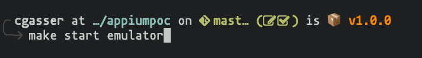
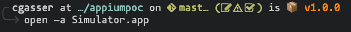
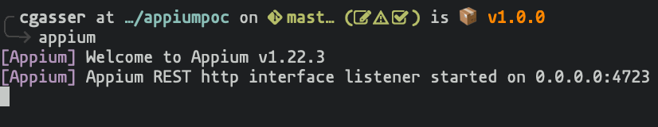
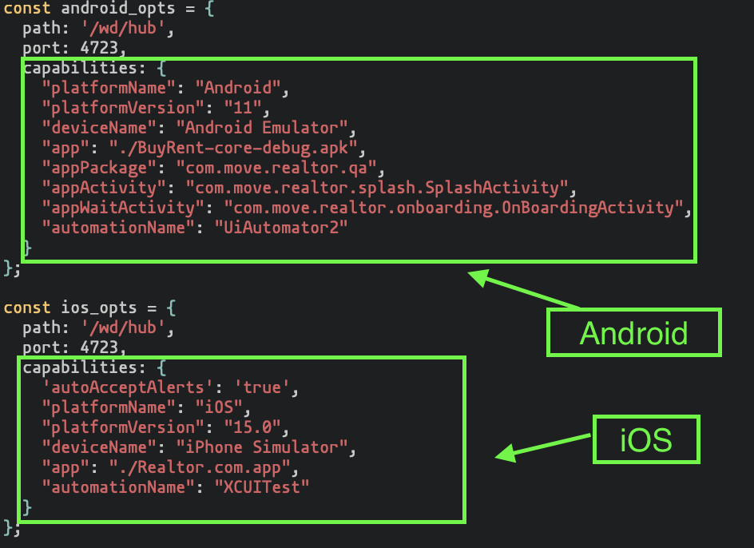
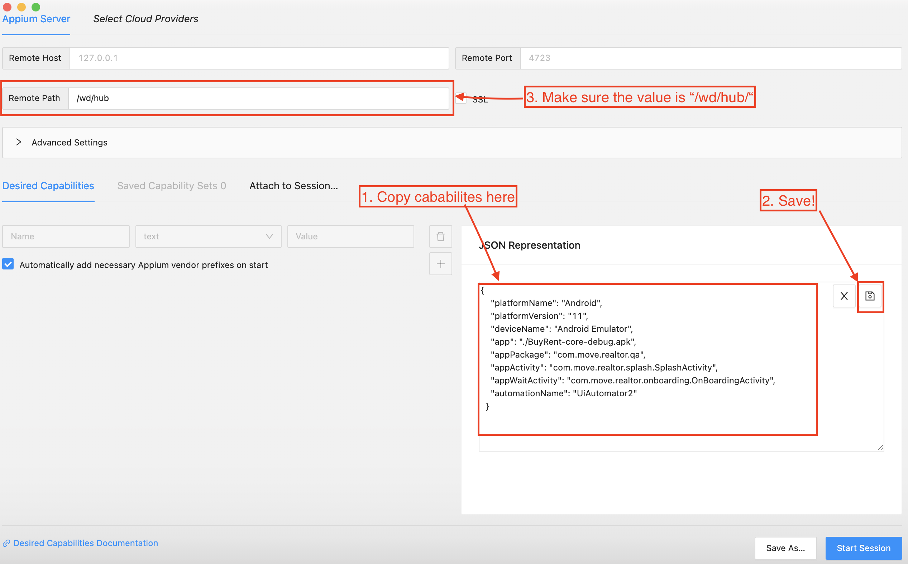
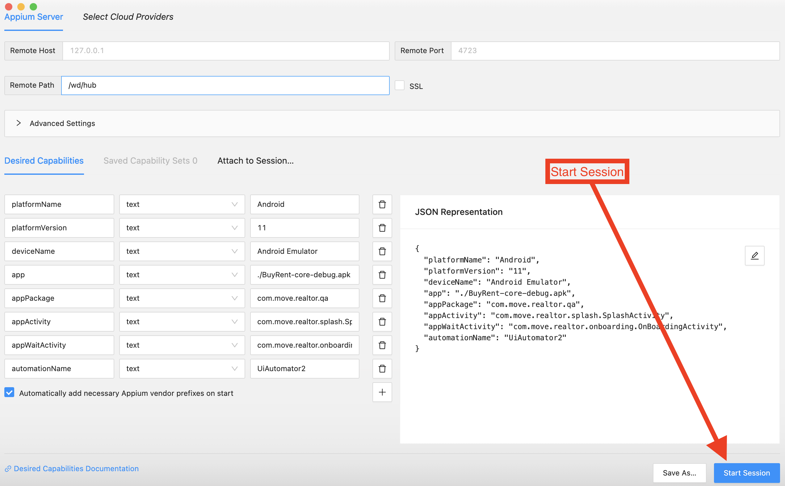
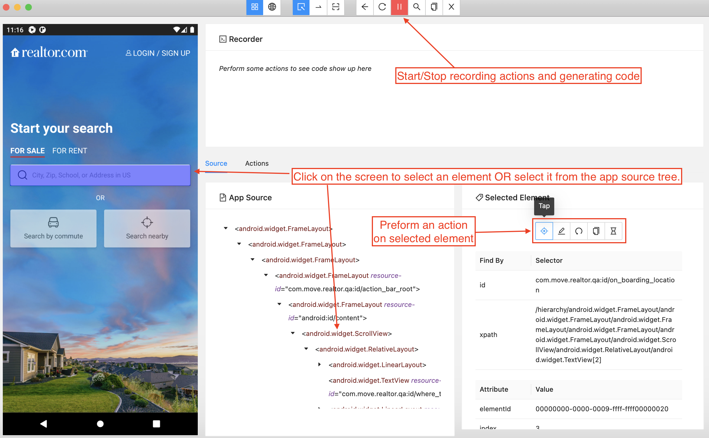
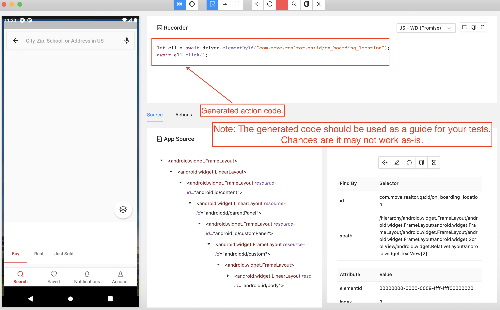

<div align="center">

# Mobile Tracking Tester


</div>

## 📄 Table of Contents

<!-- vim-markdown-toc GFM -->

- [Upcoming Changes](#upcoming-changes)
- [Getting Started](#getting-started)
  - [Requirements](#requirements)
- [Running Tests Step-by-Step](#running-tests-step-by-Step)
- [Writing Tests Step-by-Step](#writing-tests-step-by-step)
  - [Appium Inspector](#appium-inspector)
  - [Mocha Tests](#mocha-tests)
    - [Appium Test](#appium-test)
    - [Data Test](#data-test)
  - [Resources](#resources)
    - [General](#general)
    - [Appium](#appium)
    - [Proxy](#proxy)
    - [Android](#android)

<!-- vim-markdown-toc -->

## Upcoming Changes

- [ ] Migrate from JavaScript to Python. This is needed due to the proxy wrapper for JavaScript being outdated.
- [ ] Migrate build system from bash/make to task. A concurrent, easier to use build tool.

## Getting Started

### Requirements

| Software                                            | Version   | Resources |
| --------------------------------------------------- | --------- | --------- |
| GNU Make                                            | >=3.81    |           |
| NodeJS                                              | >=14.15.4 |           |
| NPM                                                 | >=6.14.10 |           |
| Xcode                                               | >=13      |           |
| iOS App or Android APK                              |           |           |
| Appium Inspector (Optional, but highly recommended) |           |           |

## Running Tests Step-by-Step

1. Clone this repository.
2. Place iOS and Android applications in this project folder. (Names need to be `BuyRent-core-debug.apk` and `Realtor.com.app` respectively).
3. Run the application with `./run.sh`. The first run will take a while.
4. Results of tests will be opened in your browser.

## Writing Tests Step-by-Step

### Appium Inspector

1. [Download and install Appium Inspector.](https://github.com/appium/appium-inspector/releases)
2. Start your respective emulator. Make sure to give it time to boot up completely.

- Android: Run `make start-emulator` in your terminal. Make sure you're in the project directory.
  
- iOS: Run `open -a Simulator.app` in your terminal.
  

3. Start the Appium server in a seperate console with the command `appium`
   
4. Copy the `capabilites` section from `src/__test__/appium.test.js` for Android (`android_opts`) or iOS (`ios_opts`) respectively.
   
5. Paste the configuration into `JSON Representation` of the Appium Inspector. **Make sure to save it!**
6. Make sure `Remote Path` of Appium Inspector is set to `/wd/hub`
   
7. Start the Appium Inspector and use it to generate the code you need for `appium.test.js`.
   

- To record your actions and generate code, enable the "eye" icon at the top of the inspector. **Do not click inside the emulator its self, only inside the view the inspector gives you!**
  
  

### Mocha Tests

There are two parts to writing a test. That Appium test that triggers the tracking event and the test to compare the actual data.

#### Appium Test

There are 3 important functions to include. `before`, `after`, and the `describe` or your Appium test its self.

- **before:** This should include setting up the proxy and its handler. The handler needs to push messages to the respective array depending on device.
  - For Android `androidMessages`
  - For iOS `iosMessages`
- **after:** This is for test cleanup tasks. The important thing to note here is the `setTimeout`. If you find your tests are taking a while and failing due to time out
  increase this number.
- **describe:** This is where the code generated in the Appium Inspector goes. Chances are the code won't work out-of-the-box. You'll need to tweak how elements are selected.
  If you're having trouble, reference your code against the examples given here.

**Example Android Test** (as seen in `src/__test__/appium.test.js`)

```javascript
describe("Android Appium Automation", () => {
  before(async () => {
    let requestHandler = (message) => {
      androidMessages.push(message);
    };
    proxy = await Mitmproxy.Create(requestHandler, [], true, true);
  });

  after(async () => {
    await new Promise((resolve) => setTimeout(resolve, 30000));
    await driver.deleteSession();
    await proxy.shutdown();
  });

  describe("Gather data for example test", () => {
    it("goes to the search page and looks for a zip code", async () => {
      driver = await wdio.remote(android_opts);
      driver.setImplicitTimeout(30000);
      let el1 = await driver.$(
        "//android.widget.TextView[contains(@resource-id,'on_boarding_location')]"
      );
      await el1.click();
      let el2 = await driver.$(
        "//android.widget.EditText[contains(@resource-id,'search_edit_text')]"
      );
      await el2.click();
      await el2.setValue("66206");
      await driver.touchAction({ action: "tap", x: 1333, y: 2741 });
      await new Promise((resolve) => setTimeout(resolve, 5000));
    });
  });
});
```

**Example iOS Test** (as seen in `src/__test__/appium.test.js`)

```javascript
describe("iOS Appium Automation", () => {
  before(async () => {
    let requestHandler = (message) => {
      iosMessages.push(message);
    };
    proxy = await Mitmproxy.Create(requestHandler, [], true, true);
  });

  after(async () => {
    await new Promise((resolve) => setTimeout(resolve, 50000));
    await driver.deleteSession();
    await proxy.shutdown();
  });

  describe("Gather data for example test", () => {
    it("goes to the search page and looks for zip code", async () => {
      driver = await wdio.remote(ios_opts);
      driver.setImplicitTimeout(30000);
      let el1 = await driver.$("~closeButton");
      await el1.click();
      let el2 = await driver.$(
        '//XCUIElementTypeApplication[@name="(d)Realtor.com"]/XCUIElementTypeWindow/XCUIElementTypeOther[2]/XCUIElementTypeOther/XCUIElementTypeTextField'
      );
      await el2.click();
      let el3 = await driver.$("~City, ZIP, School, or Address");
      await el3.click();
      await el3.setValue("66206");
      let el5 = await driver.$(
        '//XCUIElementTypeCell[@name="searchCellAutocompletePlaces"]/XCUIElementTypeOther[1]/XCUIElementTypeOther'
      );
      await el5.click();
      await new Promise((resolve) => setTimeout(resolve, 5000));
    });
  });
});
```

#### Data Test

For these tests you'll need to parse out the data from `androidMessages` and `iosMessages` respectively to find what you're looking to test.

**Example Android** (as seen in `src/__test__/data.test.js`)

```javascript
appium = require("./appium.test.js");
assert = require("assert");

describe("Android data tests", () => {
  it("tests for_sale:srp_map on android.", () => {
    messages = appium.androidMessages;
    messages.forEach((m) => {
      if (m.request.rawUrl.includes("/v1/import")) {
        let batch_data = JSON.parse(m.requestBody.toString()).batch;
        batch_data.forEach((event) => {
          if ("properties" in event) {
            if (event.properties.pageName == "for_sale:srp_map") {
              assert.equal(event.properties.pageName, "for_sale:srp_map");
              assert.ok(event.integrations["Adobe Analytics"].visitorId);
            }
          }
        });
      }
    });
  });
});
```

**Example iOS** (as seen in `src/__test__/data.test.js`)

```javascript
appium = require("./appium.test.js");
assert = require("assert");

describe("iOS Data tests", () => {
  it("tests for_sale:srp_map on iOS", () => {
    messages = appium.iosMessages;
    messages.forEach((m) => {
      if (m.request.rawUrl.includes("/v1/import")) {
        let batch_data = JSON.parse(m.requestBody.toString()).batch;
        batch_data.forEach((event) => {
          if ("properties" in event) {
            if (event.properties.pageName == "for_sale:srp_map") {
              assert.equal(event.properties.pageName, "for_sale:srp_map");
              assert.ok(event.integrations["Adobe Analytics"].visitorId);
            }
          }
        });
      }
    });
  });
});
```

### Resources

#### General

- [GNU Make](https://www.gnu.org/software/make/manual/html_node/index.html)

#### Appium

- [Appium](https://appium.io/docs/en/about-appium/intro/)

#### Proxy

- [Installing CA for proxy on Android](https://docs.mitmproxy.org/stable/howto-install-system-trusted-ca-android/)

#### Android

- [Command line tools](https://developer.android.com/studio/command-line)
- [Debugger (ADB)](https://developer.android.com/studio/command-line/adb)
- [AVD Manager](https://developer.android.com/studio/command-line/avdmanager)
- [SDK Manager](https://developer.android.com/studio/command-line/sdkmanager)
